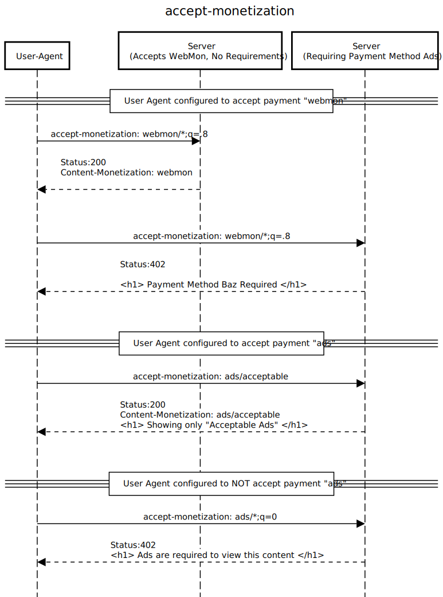

# Accept-Monetization Explainer

## Author:

- [Matt Mankins](https://github.com/mankins)

Last Update: January 7, 2022

## Participate
- [Issue tracker](https://github.com/mankins/accept-monetization-proposal/issues)
- [Contribute](CONTRIBUTING.md)
- [Experimentation Repo](https://github.com/mankins/accept-monetization)

## Introduction

[Content Negotiation](https://developer.mozilla.org/en-US/docs/Web/HTTP/Content_negotiation) has been used by web browsers and servers as a means of serving different forms of content located at a single URI. The Content Negotiation ecosystem includes `http headers`:

| Header            | Usage                    |
| ----------------- | ------------------------ |
| `Accept`          | Format/Mime Type         |
| `Accept-Charset`  | Character Encoding       |
| `Accept-Language` | Natural Language         |
| `Accept-Encoding` | Compression capabilities |

This proposal suggests to expand Content Negotation with the addition of a further header, `accept-monetization` to convey a client's payment (monetization) preference.

| Header                | Usage                   |
| --------------------- | ----------------------- |
| `Accept-Monetization` | Monetization preference |


Additionally this proposal opens up the possibility of the server utilizing the HTTP status code `402` to signify that the client's request cannot be fulfilled because of monetary reasons. A MIME-like taxonomy of monetization methods is imagined as part of this proposal.

Today's platform treats monetization as an application level function, requiring developers to do significant work on each request to probe for a user's monetization desires, often delaying the rendering of a web page. For example a user may not want to see behavioral ads but a website may require them–or an alternative–in order to render a page. This proposal makes explicit each party's requirements, which we believe will lead to better web experience.

## Goals

It would be nice to let the server know what kinds of monetization methods a user desires. These could be used in conjunction with response status codes and headers to negotiate a payment method acceptable to both the user agent and the server. Different user experiences and content payloads can be served for a client that does not wish to be served ads, for instance.

In the present, an end-user is forced to see a generic, all-monetization-methods web page without regard to how they may wish to support a website. This has lead to bloated user interfaces that repeatedly ask users to subscribe, buy a pass, tip, turn on ads, etc. in order to support the web page in question.

Furthermore current client-side code often runs to detect various monetization methods, delaying page rendering–as well as significantly increases the developer complexity for rendering pages. Without this proposal it is common for multiple page layouts to be included in a response, for example a layout without ads may be significantly different than with ads.

It would be ideal for an end-user to specify their global monetization desires in a browser: { `ads/contextual`, `subscription/*`, `webmon/*` ...} as well as methods they are not willing to use: { `ads/behavioral` }, similar to how a user can specify a language preference. When there is a mismatch between client desires and server needs, the server can respond with a special page (and status code `402`) that allows users to understand the error and choose to change their preferences for a period of time, etc.

It is imagined that a browser-level interface for specifying and negotiating monetization methods could be built off of these headers, however they may be added initially via browser extensions.

## Non-goals

This proposal is not meant to include an exhaustive definition of a taxonomy of monetization methods, eg: `ads/contextual`.

## Client Header Syntax

```
Accept-Monetization: <monetization method>
Accept-Monetization: *

// Multiple types, weighted with the quality value syntax:
Accept-Monetization: webmon, ads;q=0.9, *;q=0
```

## Server Response Syntax

When an `accept-monetization` header is sent by the client the server can respond with a `content-monetization` response header.

```
HTTP/1.1 200 Ok
Content-Monetization: webmon
```

If multiple versions of a URI are served depending on the state of the `accept-monetization` header, then the server should also add to the `Vary` header so that caches are correctly storing the response:

```
HTTP/1.1 200 Ok
Content-Monetization: webmon
Vary: accept-monetization
```

## Monetization Types

It's imagined that we'd use a taxonomy similar to that used in MIME for various payment types and subtypes used within the headers. Some example usage:

| Monetization Type | Meaning |
| ----------------- | ------- | 
| `ads/behavioral` | "Ads" type, "behavioral" subtype |
| `ads/*` | Any "Ads" type |
| `subscriptions/*` | Open to subscriptions  |
| `subscriptions/xyz` | Open to a particular type of subscription of subtype "xyz"  |
| `pass/lorem` | "pass" provider of subtype "lorem" |
| `webmon/*` | Any Web Monetization "webmon" provider |


Note that these types don't necessarily mean that the user has these monetization methods, just that they're open to using them. For instance a user may be open to subscriptions and indicate as much by passing along `accept-monetization: subscriptions/*`.


## Key Interactions



## Example: Chosen Monetization method

When a client and server are able to agree on a payment method, the server should return the chosen payment method in its response headers:

Client:

```
accept-monetization: ads
```

Server:

```
HTTP/1.1 200 Ok
Content-Monetization: ads
```

## Example: Failed Negotiation

A user could convey a preference for certain types of ads or web passes using this header as well:

```
accept-monetization: ads/*;q=.1
```

If a server is not able to fulfil the client's request, it can use HTTP status codes to indicate this to the client:

```
HTTP/1.1 402 Payment Required
Content-type: text/html
.
.
.
<p>No content is available that matches your Payment Preferences</p>
```

## Detailed design discussion

Without making payment preferences explicit, the client code is left to guessing, which can cause unnecessary burdens to be placed on the client–for instance loading large amounts of advertising and tracking code when the user does not desire to support the website in this manner. Client code is then left to probe to see if a user has an ad blocker installed so that it can fix rendering mistakes caused by missing ads.

This proposal imagines another, opportunistic way of rendering the page. The user agent passes along the user's payment desires–possibly modified by numerous browser extensions installed by the user–to the server which can then choose the best response for the user, or indicate that there's a mismatch between client and server's capabilities. This author believes that the best way forward is to have a conversation between user and website as to how the user wants to support the website, if at all.

It's often asked what about "bad actors"–those that claim they have a certain desired payment method, but don't actually have this capability? For instance, you could imagine a client sending along a header: `accept-monetization: *`, which would say "I'm ok with any kind of payment method". The server would then opportunistically choose its preferred payment method, and presumably there is an interaction on the client to initiate this payment–for instance, the page knows that an ad should load, or web monetization extension should be detectable via JavaScript. In the case that a client can't start the payment method, the user interface could say as much (much like happens now with ad block detectors) or simply reload the page.

It should be noted that no new privacy information is given up with the addition of this header, as client-side code can already detect the presence of ad blockers or other client-side requirements for payment, implemented via cookies, browser extensions, or other methods.

By making use of http status code 402, `Vary:`, `Content-Monetization:` (server side) and `Accept-Monetization:` (client) the parties can negotiate the best possible outcome that maximizes experience.


## Stakeholder Feedback / Opposition

[I've submitted a PR to add support to the Coil extension via declarativeNetRequest](https://github.com/coilhq/web-monetization-projects/pull/1916).

It should be noted that while I did this work as a Mozilla Fellow this work is not endorsed or motivated by Mozilla and is done individually.


